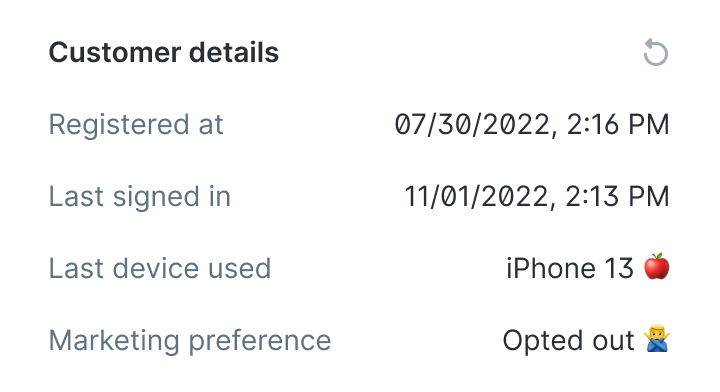
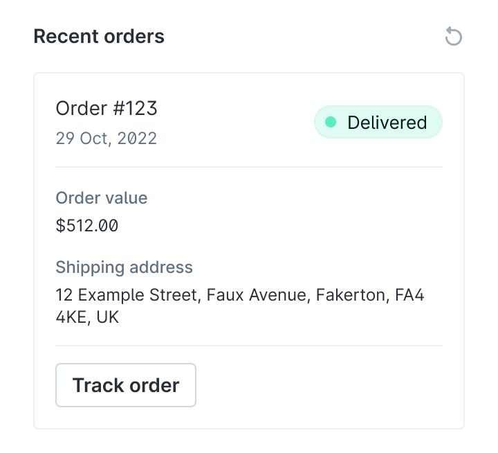
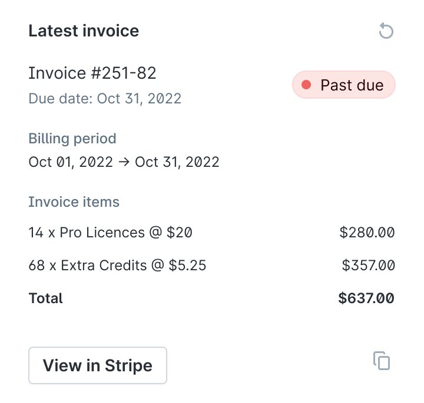
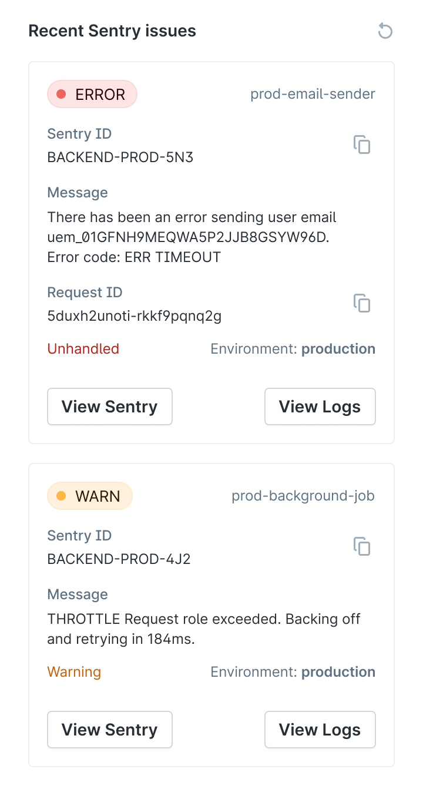
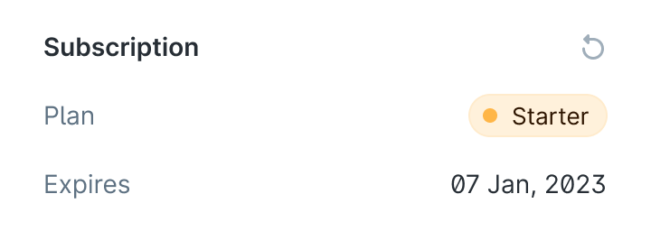
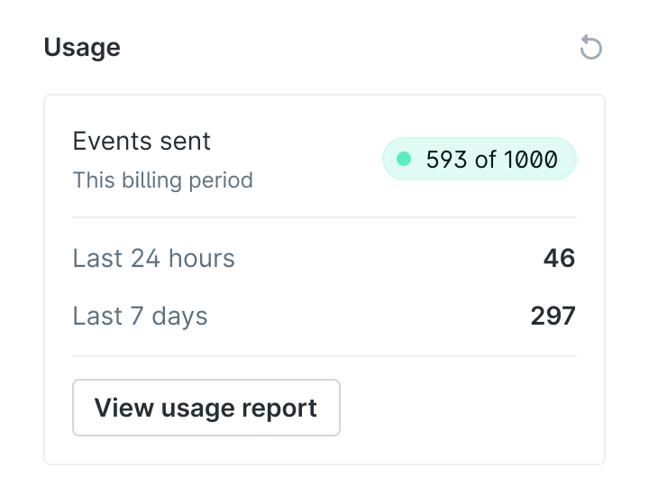

# Example Plain Customer Cards

This repo is for a dummy backend which enables the building, testing and demoing of [Plain Customer Cards](https://docs.plain.com/adding-context/customer-cards).

The cards are generally static with only a few parts changing (such as timestamps).

## Example cards

Each card has a card key that can be used when creating a Customer Card Config in your settings.

### `customer-details`



### `last-order`



### `latest-invoice`



### `sentry`



### `subscription-status`



### `usage`




## Trying the example cards

Go to Plain, log in and go to your workspace **Settings → Customer Cards**. Then create a new customer card with the following values:

- **Title:** you can enter whatever you'd like, this will be shown in the Customer Panel
- **Card key:** One of the card keys from above, or you can find in [src/example-cards/](./src/example-cards). Not sure what to pick? Try `subscription-status` or `last-order`.
- **Default TTL:** you can enter whatever you like (for example 15 seconds for a short TTL)
- **URL:** `https://example-customer-cards.plain.com/?cardKey={{CARD_KEY}}` replacing `{{CARD_KEY}}` with the key you chose above.

## Building your own Plain Customer Cards

Read our documentation on the topic:
- [Building a Customer Card API](https://docs.plain.com/recipes/customer-card-api): detailed documentation on how to implement an API
- [Plain UI Components](https://docs.plain.com/adding-context/ui-components): detailed documentation about each component

## Development

### Adding a new example card

To add a new card:

1. Add it to [./src/example-cards](./src/example-cards) folder
2. Import it in [the index file](./src/example-cards/index.ts)
3. Open a PR and use the preview URL to test

### Running locally

Run the following command to run the server:

```shell
npm run start
```

This will start up the API on http://localhost:3000

Then you'll need to use something like [ngrok](https://ngrok.com/) or [localtunnel](https://theboroer.github.io/localtunnel-www/) to get a public URL which Plain can call.

**Ngrok:**

```shell
ngrok http 3000
```


**localtunnel:**

```shell
lt --port 3000
```